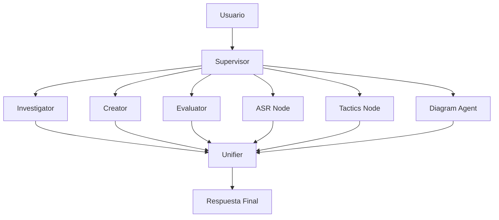
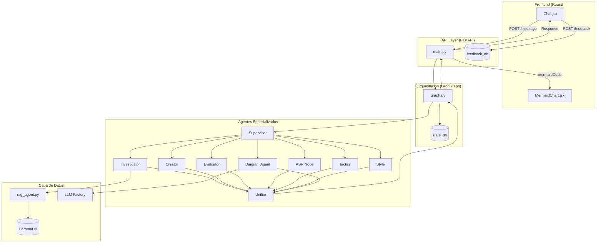

# ArchIA - Documentación Técnica del Sistema

> **Versión**: 1.0  
> **Fecha**: Febrero 2025  
> **Tipo de documento**: Especificación Técnica de Arquitectura

---

## 1. Introducción

### 1.1 Propósito de ArchIA

**ArchIA** es un asistente inteligente especializado en el diseño de arquitectura de software. Su propósito principal es asistir a arquitectos y equipos de desarrollo durante las fases tempranas del ciclo de vida del desarrollo de software (SDLC), específicamente en:

| Fase del SDLC | Contribución de ArchIA |
|---------------|------------------------|
| **Análisis de Requisitos** | Identificación y extracción de requisitos arquitectónicamente significativos (ASRs) |
| **Diseño Arquitectónico** | Recomendación de estilos arquitectónicos y tácticas de diseño |
| **Documentación** | Generación de diagramas visuales y documentación técnica |
| **Validación** | Consulta de documentación técnica de referencia (PDFs) |

### 1.2 Paradigma de Interacción

A diferencia de un chat lineal convencional, ArchIA opera mediante un **Grafo de Estados (State Graph)**. Cada mensaje del usuario inicia un flujo de razonamiento donde un "Cerebro Central" (nodo supervisor) evalúa la petición y orquesta la ejecución de herramientas especializadas antes de generar una respuesta final.



---

## 2. Arquitectura del Flujo (El Grafo de Estados)

### 2.1 Modelo de Razonamiento

El sistema utiliza **LangGraph** como motor de orquestación, implementando un grafo de estados que permite al sistema "razonar" antes de responder. El flujo sigue este ciclo:

```
┌─────────────────────────────────────────────────────────────────┐
│                     CICLO DE PROCESAMIENTO                       │
├─────────────────────────────────────────────────────────────────┤
│  1. ENTRADA      → Usuario envía mensaje                        │
│  2. SUPERVISOR   → Analiza intención y contexto                 │
│  3. ROUTING      → Decide qué nodo(s) especializado(s) activar  │
│  4. EJECUCIÓN    → Nodo(s) especializado(s) procesan la tarea   │
│  5. UNIFICACIÓN  → Se consolida la información generada         │
│  6. RESPUESTA    → Se genera y entrega respuesta al usuario     │
└─────────────────────────────────────────────────────────────────┘
```

### 2.2 Nodo Supervisor (Cerebro Central)

El **Supervisor** es el coordinador principal del sistema. Su responsabilidad es:

1. **Análisis de Intención**: Determina qué tipo de solicitud hace el usuario (`general`, `greeting`, `architecture`, `diagram`, `asr`, `tactics`, `style`)
2. **Detección de Idioma**: Identifica si el usuario escribe en español o inglés
3. **Decisión de Enrutamiento**: Selecciona el siguiente nodo a ejecutar

**Estructura de la respuesta del Supervisor:**

```python
class supervisorResponse(TypedDict):
    localQuestion: str  # Pregunta refinada para el nodo worker
    nextNode: Literal[
        "investigator",   # Búsqueda en documentación
        "creator",        # Generación de contenido
        "evaluator",      # Evaluación/análisis
        "diagram_agent",  # Generación de diagramas
        "tactics",        # Sugerencia de tácticas
        "asr",            # Requisitos significativos
        "style",          # Estilos arquitectónicos
        "unifier"         # Consolidación final
    ]
```

### 2.3 Nodos Especializados

| Nodo | Función | Cuándo se Activa |
|------|---------|------------------|
| **Investigator** | Búsqueda RAG en documentos PDF | Consultas que requieren fundamentación técnica |
| **Creator** | Generación de contenido nuevo | Solicitudes de creación de artefactos |
| **Evaluator** | Análisis y comparación | Evaluación de opciones arquitectónicas |
| **ASR** | Extracción de requisitos | Identificación de requisitos significativos |
| **Tactics** | Sugerencia de tácticas | Mejora de atributos de calidad |
| **Style** | Recomendación de estilos | Selección de patrones arquitectónicos |
| **Diagram Agent** | Generación de diagramas | Visualización de arquitecturas |
| **Unifier** | Consolidación | Siempre al final del flujo |

### 2.4 Estado del Grafo

El sistema mantiene un estado tipado (`GraphState`) que se propaga entre nodos:

```python
class GraphState(TypedDict):
    # Control de flujo
    messages: list[AnyMessage]     # Historial de conversación
    userQuestion: str              # Pregunta original
    localQuestion: str             # Pregunta refinada
    nextNode: str                  # Siguiente nodo a ejecutar
    
    # Flags de visita
    hasVisitedInvestigator: bool
    hasVisitedCreator: bool
    hasVisitedEvaluator: bool
    hasVisitedASR: bool
    hasVisitedDiagram: bool
    
    # Contexto arquitectónico
    current_asr: str               # ASR vigente
    quality_attribute: str         # Atributo de calidad principal
    selected_style: str            # Estilo seleccionado
    tactics_list: list             # Lista de tácticas
    tactics_md: str                # Tácticas en formato Markdown
    
    # RAG y memoria
    doc_context: str               # Contexto de documentos
    retrieved_docs: list           # Documentos recuperados
    memory_text: str               # Memoria de conversación
    
    # Diagramas
    mermaidCode: str               # Código Mermaid generado
    diagram: dict                  # Datos del diagrama
```

---

## 3. Desglose de Componentes

### 3.1 Módulo de Documentación (RAG)

**Propósito**: Capacidad de buscar información dentro de archivos PDF proporcionados por el usuario para dar respuestas con fundamentación técnica.

**Implementación**: 
- Archivo: [`rag_agent.py`](file:///c:/Users/mgs05/Documents/GargoyleArchitecture/ArchIA/back/src/rag_agent.py)
- Base de datos vectorial: **ChromaDB**
- Modelo de embeddings: OpenAI `text-embedding-3-small`

**Flujo de trabajo**:

```
┌─────────────┐     ┌─────────────┐     ┌─────────────┐
│  Pregunta   │ ──► │  Embeddings │ ──► │  ChromaDB   │
│  Usuario    │     │  OpenAI     │     │  Búsqueda   │
└─────────────┘     └─────────────┘     └──────┬──────┘
                                               │
                         ┌─────────────────────▼──────────────────────┐
                         │  Top-K documentos relevantes (k=6)         │
                         └─────────────────────┬──────────────────────┘
                                               │
                         ┌─────────────────────▼──────────────────────┐
                         │  Contexto inyectado en prompt del LLM      │
                         └────────────────────────────────────────────┘
```

**Características clave**:
- Filtrado por título de documento
- Persistencia en directorio `chroma_db/`
- Construcción de índice via [`build_vectorstore.py`](file:///c:/Users/mgs05/Documents/GargoyleArchitecture/ArchIA/back/build_vectorstore.py)

---

### 3.2 Módulo de Visualización (Diagramas)

**Propósito**: Transformar descripciones textuales en diagramas arquitectónicos visuales.

**Formatos soportados**:
- **Mermaid**: Diagramas de flujo y componentes
- **PlantUML**: Diagramas de despliegue y secuencia

**Flujo de generación**:

```
┌──────────────┐     ┌──────────────┐     ┌──────────────┐
│  Prompt NL   │ ──► │  LLM genera  │ ──► │  Sanitización│
│  + ASR       │     │  código      │     │  sintaxis    │
└──────────────┘     └──────────────┘     └──────┬───────┘
                                                  │
                                    ┌─────────────▼─────────────┐
                                    │  Renderizado              │
                                    │  • Kroki (PlantUML)       │
                                    │  • Frontend (Mermaid)     │
                                    └───────────────────────────┘
```

**Componentes clave**:
- [`diagram_agent.py`](file:///c:/Users/mgs05/Documents/GargoyleArchitecture/ArchIA/back/src/diagram_agent.py): Orquestación de generación
- [`diagramCreator.py`](file:///c:/Users/mgs05/Documents/GargoyleArchitecture/ArchIA/back/src/diagramCreator.py): Lógica de creación
- [`MermaidChart.jsx`](file:///c:/Users/mgs05/Documents/GargoyleArchitecture/ArchIA/front/src/components/MermaidChart.jsx): Renderizado en frontend

---

### 3.3 Módulo de Recomendación

**Propósito**: Sugerir estilos de diseño arquitectónico y tácticas para mejorar atributos de calidad.

#### 3.3.1 Nodo de Estilos (`style`)

Recomienda patrones arquitectónicos como:
- Microservicios
- Monolito modular
- Event-driven
- CQRS
- Serverless

#### 3.3.2 Nodo de Tácticas (`tactics`)

Sugiere tácticas específicas para atributos de calidad:

| Atributo de Calidad | Tácticas Ejemplo |
|---------------------|------------------|
| **Escalabilidad** | Elastic Horizontal Scaling, Load Balancing |
| **Disponibilidad** | Circuit Breaker, Fallback, Replicación |
| **Latencia** | Cache-Aside, CDN, Precomputation |
| **Seguridad** | Rate Limiting, Authentication Layers |

**Estructura de salida de tácticas**:

```json
[
  {
    "name": "Elastic Horizontal Scaling",
    "purpose": "Keep p95 latency under 200ms during 10x bursts",
    "rationale": "Autoscale replicas based on concurrency",
    "risks": ["Higher peak spend"],
    "tradeoffs": ["Cost vs. resilience"],
    "categories": ["scalability", "latency"],
    "success_probability": 0.82,
    "rank": 1
  }
]
```

---

### 3.4 Módulo de Requisitos (ASR)

**Propósito**: Identificar y extraer **Requisitos Arquitectónicamente Significativos** de la conversación.

**Estructura de un ASR**:

```
┌─────────────────────────────────────────────────────────────┐
│  QUALITY ATTRIBUTE SCENARIO (ASR)                           │
├─────────────────────────────────────────────────────────────┤
│  • Source: Quién genera el estímulo                         │
│  • Stimulus: Qué evento dispara el escenario                │
│  • Artifact: Qué componente recibe el estímulo              │
│  • Environment: Condiciones operativas                      │
│  • Response: Cómo debe responder el sistema                 │
│  • Response Measure: Métrica cuantificable                  │
└─────────────────────────────────────────────────────────────┘
```

**Ejemplo**:
> "Cuando 10,000 usuarios concurrentes acceden al checkout durante Black Friday, el sistema debe procesar las transacciones con latencia p95 < 200ms y 99.9% de disponibilidad."

---

## 4. Modelo de Persistencia

### 4.1 Visión General

```
┌─────────────────────────────────────────────────────────────────┐
│                     CAPAS DE PERSISTENCIA                       │
├─────────────────────────────────────────────────────────────────┤
│                                                                  │
│  ┌───────────────┐  ┌───────────────┐  ┌───────────────┐        │
│  │  ChromaDB     │  │  SQLite       │  │  SQLite       │        │
│  │  (chroma_db/) │  │  (state_db/)  │  │  (feedback_db)│        │
│  ├───────────────┤  ├───────────────┤  ├───────────────┤        │
│  │ Embeddings    │  │ Checkpoints   │  │ Likes/Dislikes│        │
│  │ documentos    │  │ del grafo     │  │ por mensaje   │        │
│  └───────────────┘  └───────────────┘  └───────────────┘        │
│                                                                  │
└─────────────────────────────────────────────────────────────────┘
```

### 4.2 Almacenamiento de Conversación

**Tecnología**: LangGraph `SqliteSaver`

```python
# Ubicación: back/state_db/example.db
conn = sqlite3.connect(str(DB_PATH), check_same_thread=False)
sqlite_saver = SqliteSaver(conn)
```

**Información almacenada**:
- Historial completo de mensajes
- Estados intermedios del grafo
- Checkpoints para recuperación

### 4.3 Almacenamiento de Decisiones

El estado del grafo persiste automáticamente las decisiones arquitectónicas:

| Campo | Descripción |
|-------|-------------|
| `current_asr` | ASR vigente en la sesión |
| `selected_style` | Estilo arquitectónico elegido |
| `tactics_list` | Lista de tácticas aplicadas |
| `quality_attribute` | Atributo de calidad prioritario |

### 4.4 Registro de Retroalimentación

**Ubicación**: `back/feedback_db/feedback.db`

```sql
CREATE TABLE feedback (
    id INTEGER PRIMARY KEY AUTOINCREMENT,
    session_id TEXT NOT NULL,
    message_id INTEGER NOT NULL,
    thumbs_up INTEGER DEFAULT 0,
    thumbs_down INTEGER DEFAULT 0,
    timestamp TEXT DEFAULT CURRENT_TIMESTAMP
);
```

**Propósito**: Almacenar reacciones del usuario (👍/👎) para mejora continua del sistema.

---

## 5. Ciclo de Usuario

### 5.1 Flujo Completo: De Consulta a Diagrama

```
┌─────────────────────────────────────────────────────────────────────────────┐
│                          CICLO DE USUARIO COMPLETO                          │
└─────────────────────────────────────────────────────────────────────────────┘

     ┌─────────────┐
  1. │  USUARIO    │ "Necesito que mi API soporte 10k usuarios con latencia <200ms"
     └──────┬──────┘
            │
            ▼
     ┌─────────────┐
  2. │  FRONTEND   │ Chat.jsx envía POST /message con session_id
     └──────┬──────┘
            │
            ▼
     ┌─────────────┐
  3. │  BACKEND    │ main.py recibe y preprocesa la solicitud
     └──────┬──────┘
            │
            ▼
     ┌─────────────┐
  4. │ SUPERVISOR  │ Analiza: intención=architecture, idioma=es
     │             │ Decide: nextNode="asr"
     └──────┬──────┘
            │
            ▼
     ┌─────────────┐
  5. │  ASR NODE   │ Extrae: Quality Attribute Scenario
     │             │ → "Scalability: 10k concurrent, p95 <200ms"
     └──────┬──────┘
            │
            ▼
     ┌─────────────┐
  6. │ SUPERVISOR  │ Decide: nextNode="style"
     └──────┬──────┘
            │
            ▼
     ┌─────────────┐
  7. │ STYLE NODE  │ Recomienda: "Microservicios con API Gateway"
     └──────┬──────┘
            │
            ▼
     ┌─────────────┐
  8. │ SUPERVISOR  │ Decide: nextNode="tactics"
     └──────┬──────┘
            │
            ▼
     ┌─────────────┐
  9. │TACTICS NODE │ Sugiere: [Elastic Scaling, Cache-Aside, Circuit Breaker]
     └──────┬──────┘
            │
            ▼
     ┌─────────────┐
 10. │ SUPERVISOR  │ Decide: nextNode="diagram_agent"
     └──────┬──────┘
            │
            ▼
     ┌─────────────┐
 11. │DIAGRAM NODE │ Genera código Mermaid basado en ASR + estilo + tácticas
     └──────┬──────┘
            │
            ▼
     ┌─────────────┐
 12. │  UNIFIER    │ Consolida respuesta final con texto + diagrama
     └──────┬──────┘
            │
            ▼
     ┌─────────────┐
 13. │  FRONTEND   │ MermaidChart.jsx renderiza el diagrama
     │             │ Chat.jsx muestra la explicación textual
     └──────┬──────┘
            │
            ▼
     ┌─────────────┐
 14. │  USUARIO    │ Ve diagrama arquitectónico + recomendaciones
     │             │ Puede dar feedback (👍/👎) que se almacena
     └─────────────┘
```

### 5.2 Puntos de Integración

| Componente | Tecnología | Puerto | Función |
|------------|------------|--------|---------|
| **Backend** | FastAPI + Uvicorn | 8000 | API REST, orquestación |
| **Frontend** | React + Vite | 5173 | Interfaz de usuario |
| **Vectorstore** | ChromaDB | Embebido | Búsqueda semántica |
| **Diagramas** | Kroki | Externo | Renderizado PlantUML |

---

## 6. Jerarquía de Archivos

```
ArchIA/
├── back/                           # Backend Python
│   ├── src/
│   │   ├── main.py                 # Entry point FastAPI
│   │   ├── graph.py                # State Graph (LangGraph)
│   │   ├── rag_agent.py            # Módulo RAG
│   │   ├── diagram_agent.py        # Orquestador de diagramas
│   │   ├── diagramCreator.py       # Generador de código
│   │   ├── memory.py               # Gestión de memoria
│   │   ├── services/
│   │   │   ├── llm_factory.py      # Factory de modelos LLM
│   │   │   ├── diagram_llm.py      # LLM para diagramas
│   │   │   ├── diagram_nl.py       # Procesamiento NL
│   │   │   └── doc_ingest.py       # Ingesta de documentos
│   │   ├── clients/
│   │   │   └── kroki_client.py     # Cliente Kroki
│   │   └── utils/
│   │       └── json_helpers.py     # Utilidades JSON
│   ├── chroma_db/                  # Base vectorial
│   ├── state_db/                   # Checkpoints del grafo
│   ├── feedback_db/                # Feedback de usuarios
│   ├── docs/                       # PDFs de referencia
│   └── docs_uploads/               # PDFs subidos por usuarios
│
├── front/                          # Frontend React
│   ├── src/
│   │   ├── App.jsx                 # Componente raíz
│   │   ├── main.jsx                # Entry point
│   │   └── components/
│   │       ├── Chat.jsx            # Panel de conversación
│   │       ├── MermaidChart.jsx    # Renderizador de diagramas
│   │       └── Header.jsx          # Cabecera
│   └── public/                     # Assets estáticos
│
└── README.md                       # Instrucciones de arranque
```

---

## 7. Flujo de Datos Consolidado



---

## 8. Consideraciones Técnicas

### 8.1 Dependencias Principales

| Componente | Versión/Tecnología |
|------------|-------------------|
| Python | 3.11+ |
| LangChain | Latest |
| LangGraph | Latest |
| FastAPI | Con Uvicorn |
| ChromaDB | Persistente |
| OpenAI | GPT-4o / text-embedding-3-small |
| React | Con Vite |

### 8.2 Variables de Entorno Críticas

```bash
OPENAI_API_KEY=<tu-api-key>
OPENAI_MODEL=gpt-4o
OPENAI_EMBED_MODEL=text-embedding-3-small
DIAGRAM_FORMAT=svg
LOG_LEVEL=INFO
```

---

> **Documento generado por**: ArchIA Documentation System  
> **Basado en análisis de**: Repositorio GargoyleArchitecture/ArchIA
